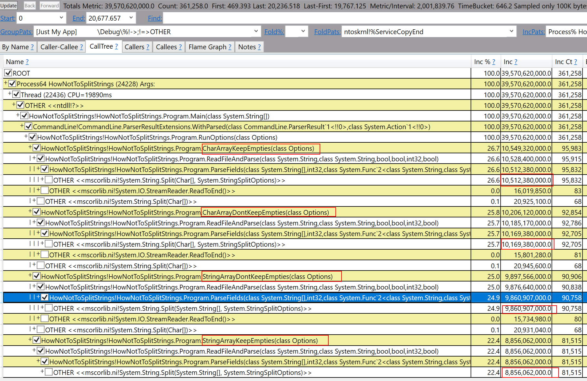

#How **not** to split strings in .NET.

## Intro

This issue within .NET was identified as part of a performance analysis being within within some client code.

Although we would like to think that the .NET Framework has/had been thoroughly vetted from a performance perspective, the truth is likely mucher further from this than we'd like.

## Who's impacted?

This issue impacts two main category of tasks:

1. ETL-type operations processing large quantities of text.
2. Use of String.Split within multi-threaded scenarios such as web processing.
3. Quantity of **expensive** Gen 2 garbage collections performed when splitting long strings.

## Overview

Internally, within the String.Split method there are two things happening that are prohibiting optimal performance under a single-delimiter scenario, which is the typical use case for this code.

1. Unnecessary and sometimes **very large data structures** being allocated, which consequently require GCs.
2. Unnecessary code paths being taken causing multiple passes through string, rather single-pass.
3. In the case of long strings the large data structure can even wind up in the LOH, forcing a Gen 2 GC to clean it up.

Here is an image showing the varying degrees of memory consumption depending on the string vs. char array overload and the StringSplitOptions specified.

The image shows the varying degrees of memory utilization as each method does the same amount of splitting on the exact same data. The only changes are the parameters specified to String.Split.

## Mitigation

As seen in the above image, the "slimmest" version of the method is the String array with KeepEmpties option. However, keep an eye out for our [upcoming high performance](https://github.com/spe-investigator/) nuget package that will reduce the memory allocations down to nominal levels.
